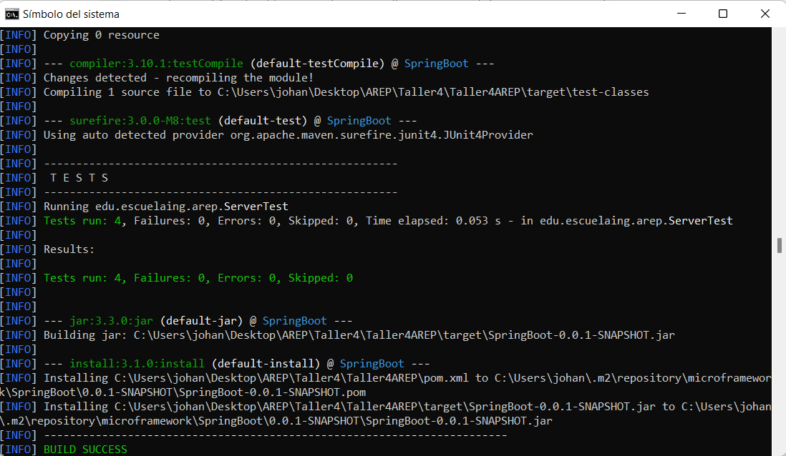
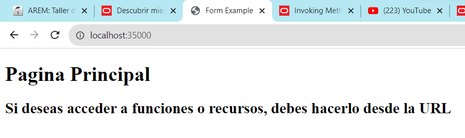
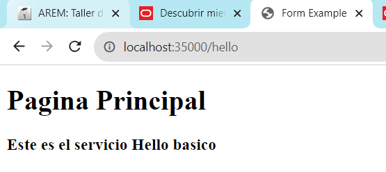
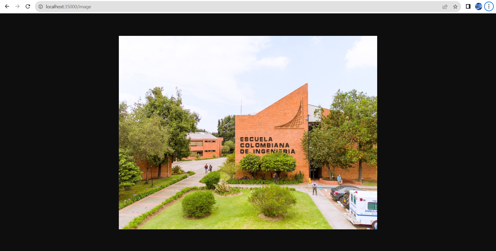

# ARQUITECTURAS DE SERVIDORES DE APLICACIONES, META PROTOCOLOS DE OBJETOS, PATRÓN IOC, REFLEXIÓN

## Introducción

En el desarrollo de este proyecto se tiene en cuenta la estructura del protocolo http con la solicitud y entrega de mensajes, lo que se desea implementar para realizar un servidor web capáz de entregar archivos estáticos de cualquier tipo como (/jpg, /png, /txt, /js, /css, entre otros), el servidor debe tener la capacidad de recorrer el directorio de archivos y poder encontrar las clases que se desean implementar que con el uso de anotaciones como `@Component` y `@RequestMapping` nos brindan la disponibilidad necesaria para ejecutar el proyecto, una vez así debemos por medio de los POJO (Plain Old Java Object) utilizar los recursos de cada clase y con el uso de la reflexión de Java poder dar ejecución a los métodos de la aplicación.

## Requisitos 

- [Git](https://git-scm.com/downloads) - Sistema de control de versiones
- [Maven](https://maven.apache.org/download.cgi) - Gestor de dependencias
- [Java](https://www.java.com/download/ie_manual.jsp) - Entorno de desarrollo
- [Eclipse](https://www.eclipse.org/downloads/) - (Opcional) Editor de texto de preferencia
- [Apache](https://httpd.apache.org/download.cgi) - Servidor Web HTTP

## **Instrucciones de ejecución Local**

1.Clonar el repositorio a la máquina local por medio de la terminal de comandos.

```
git clone https://github.com/JohanSGarciaM/Taller4AREP
```
2.Ubicarse en la carpeta Taller4AREP, limpiamos e instalamos todas las dependencias

```
mvn clean install
```
3.Generar la documentación de proyecto, se encuentra en la ruta `Taller4\Taller4AREP\target\site\apidocs\edu\escuelaing\arep`

```
mvn javadoc:javadoc
```
4.Ejecutamos las pruebas de proyecto

```
mvn test
```
5.Ejecutamos el proyecto definiendo las direcciones

```
java -cp target/classes edu.escuelaing.arep.service.MainService
```

## **Ejecutar las pruebas**

```
mvn test
```



## **Anotaciones**

Las anotaciones en java nos permiten hacer un mapeo mas sencillo a las clases o métodos que necesitamos utilizar, es una propiedad reflexiva de java y en este caso utilizamos las anotaciones de `@Component` y `@RequestMapping` donde el Tag @Component nos marca a una clase y el tag @RequestMapping nos marca un método


## **Página principal**




## **Hello Controller**



## **imagen jpg**




## **Métodos**

Los métodos se pueden definir en las clases controlador a necesidad del usuario, apuntando a los archivos estáticos que se deseen

Los métodos disponibles ahora:

- /hello
- /image
- /js
- /css

## **Author**

- [Johan Garcia](https://github.com/JohanSGarciaM)


